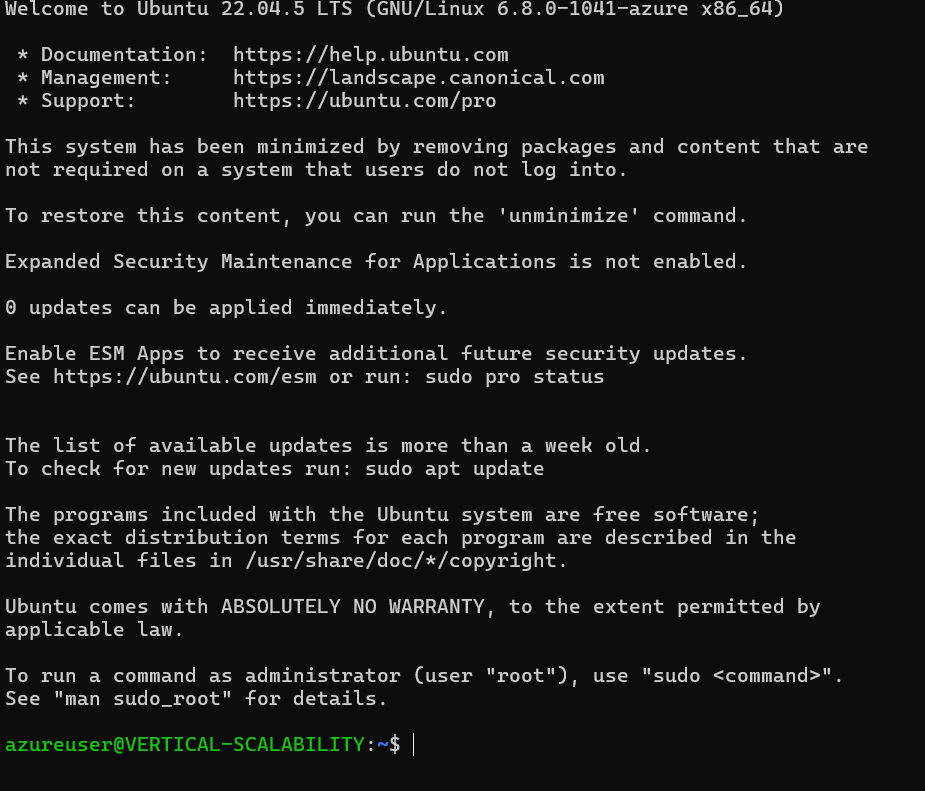
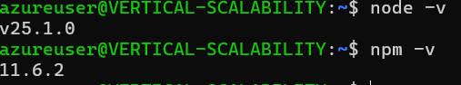
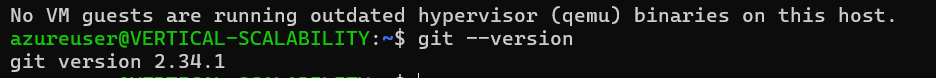
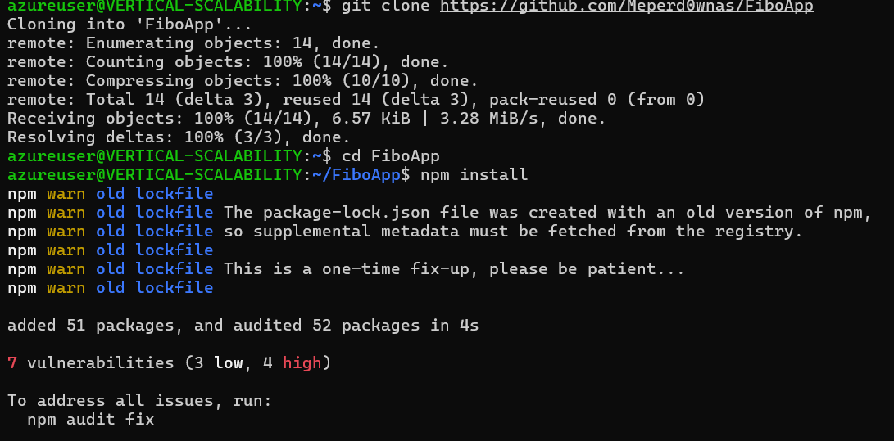
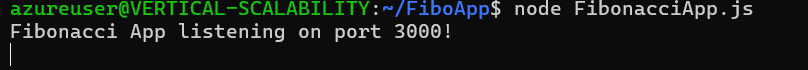

## Lab ARSW9

### Daniel Ricardo Ruge Gomez

### Parte 1 - Escalabilidad vertical

#### 1.

Creamos la VM

#### 2

Nos conectamos a la VM 

}

#### 3

Instalamos node y git

#### 4

Clonamos un repositorio que solo contenga FIbonacciApp y le instalamos las dependencias

#### 5

