## Lab ARSW9

### Daniel Ricardo Ruge Gomez

### Parte 1 - Escalabilidad vertical

#### 1. Creamos la VM

#### 2. Nos conectamos a la VM 

}

#### 3. Instalamos node y git

#### 4. Clonamos un repositorio que solo contenga FIbonacciApp y le instalamos las dependencias

#### 5. ponemos a correr la APP e instalamos forever

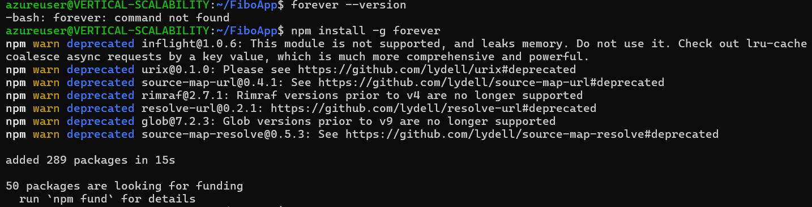

#### 6. creamos una Inbound port rule como se nos indico

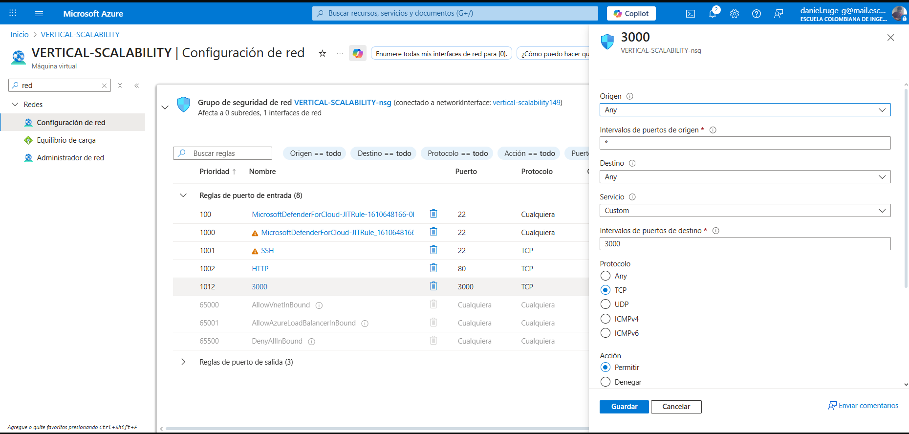

#### 7. verificamos que el endPoint funciona (para este punto me toco crear otra VM por que la primera dejo de funcionar)

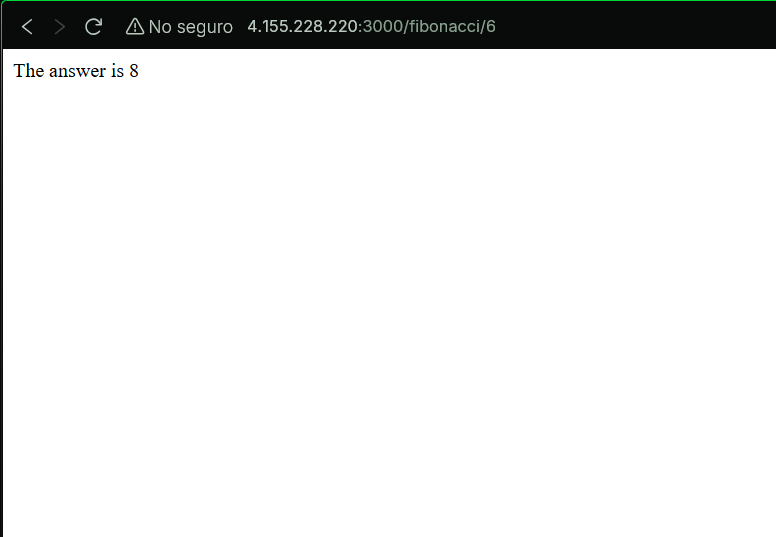

#### 8. verificamos el consumo

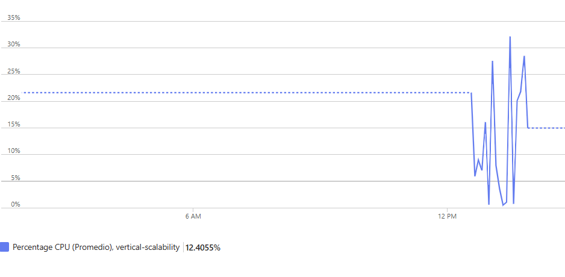

#### 9. modificamos el .JSON

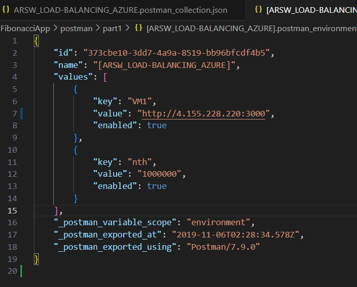

Resultados del newman

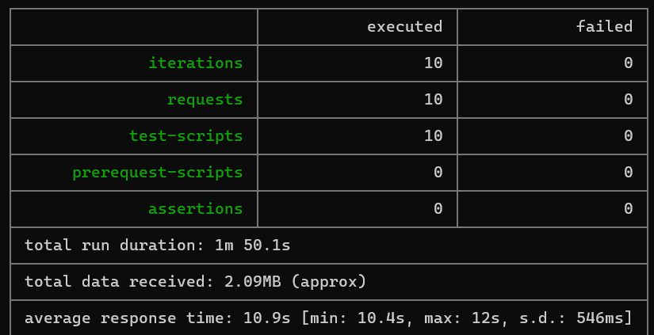

#### 10. cambiamos el tamaño

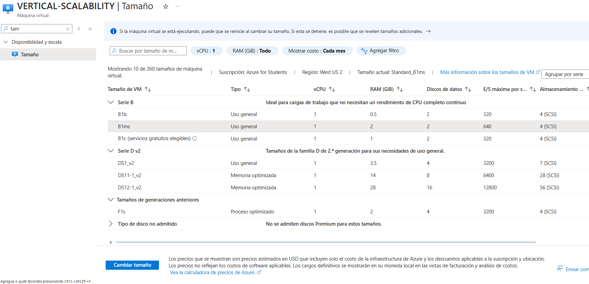

#### 11. probamos nuevamente los pasos anteriores

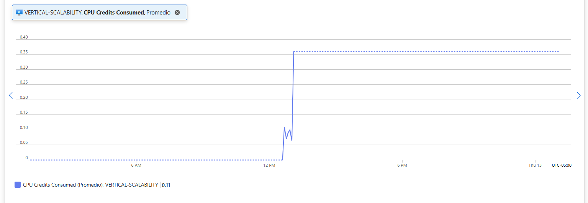

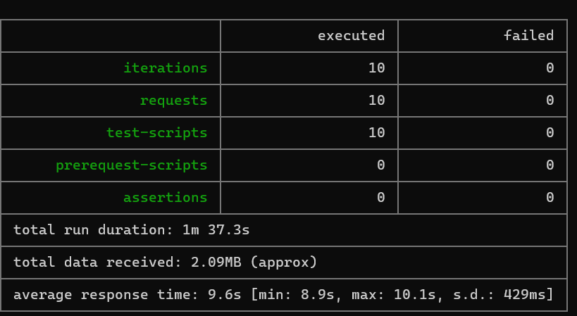

#### 12. Conclusiones

sando B2ms como escalamiento vertical sí mejora la escalabilidad y evita fallos para cargas moderadas, pero no garantiza cumplimiento absoluto del requisito si el número de usuarios concurrentes sigue aumentando. Para cargas muy altas, sería necesario combinar con escalamiento horizontal (balanceador + múltiples VMs) o mejorar el algoritmo de Fibonacci para reducir el consumo de CPU.

#### 13.

dejamos la VM en su tamaño original

### Preguntas.

#### ¿Cuántos y cuáles recursos crea Azure junto con la VM?

Cuando creas una VM básica en Azure, se crean automáticamente varios recursos asociados:

Virtual Machine (VM): la máquina virtual donde corre tu aplicación.

Network Interface (NIC): tarjeta de red que permite la comunicación de la VM.

Network Security Group (NSG): reglas de firewall que controlan el tráfico de entrada y salida.

Public IP Address: dirección IP pública asignada para acceder desde Internet.

Virtual Network (VNet): red virtual donde se ubica la VM y otros recursos.

Storage Account / OS Disk: disco de arranque de la VM.

Availability Set o Zone (opcional): asegura redundancia y alta disponibilidad.

Total aproximado: 6–7 recursos principales dependiendo de la configuración.

#### Brevemente describa para qué sirve cada recurso
Recurso	Función
Virtual Machine (VM)	Ejecuta la aplicación y procesos del sistema.
Network Interface (NIC)	Permite la conectividad de red entre VM y otros recursos.
Network Security Group (NSG)	Controla tráfico entrante y saliente hacia la VM.
Public IP Address	Permite acceder a la VM desde Internet.
Virtual Network (VNet)	Aísla la VM y permite conectividad privada entre recursos de Azure.
OS Disk / Storage Account	Almacena sistema operativo y datos persistentes de la VM.
Availability Zone/Set	Proporciona redundancia y alta disponibilidad.

#### ¿Por qué se cae la app al cerrar SSH y por qué se necesita inbound port rule?

Cierre de SSH: al ejecutar npm FibonacciApp.js directamente, el proceso corre solo en la sesión de terminal activa. Al cerrar SSH, la sesión termina y también el proceso.

Inbound port rule: Azure bloquea todo tráfico entrante por defecto. Para que tu VM acepte peticiones HTTP en el puerto 3000, necesitas crear la regla de entrada (Allow) en NSG.

#### Tabla de tiempos de respuesta
n (Fibonacci)	Tiempo total (s)
1,000,000	10.14
1,010,000	10.23
1,020,000	10.64
1,030,000	11.14
1,040,000	11.11
1,050,000	11.29
1,060,000	11.53
1,070,000	11.64
1,080,000	11.98
1,090,000	12.42

Interpretación: la función tarda tanto porque el algoritmo de Fibonacci usado es ineficiente, probablemente recursivo sin memoización, generando cálculos repetitivos que consumen CPU excesiva.

#### Imagen de consumo de CPU

No puedo adjuntar imagen aquí, pero tu captura en Azure mostrará CPU cercano al 100% bajo carga.

Interpretación: la función hace cálculos intensivos de CPU. Cada solicitud bloquea el hilo principal, causando que la VM se sature fácilmente.

#### Resumen de ejecución de Postman

Tiempos de ejecución: similares a la tabla anterior (10–12 s).

Fallos: ocurren cuando la VM se satura bajo múltiples peticiones concurrentes. Esto muestra que la capacidad original (B1ls) no es suficiente para cargas simultáneas.

#### Diferencia B2ms vs B1ls
Característica	B1ls	B2ms
vCPU	1	2
RAM	0.5 GB	8 GB
Uso recomendado	Cargas ligeras	Cargas medianas
Ventaja adicional	Bajo costo	Más capacidad y paralelismo

No solo infraestructura: B2ms permite manejar más peticiones simultáneas sin saturar CPU y reduce riesgo de fallos bajo concurrencia.

#### ¿Aumentar tamaño de la VM es buena solución?

Sí, para cargas moderadas mejora la capacidad y evita que la VM se bloquee.

Qué pasa con FibonacciApp: la aplicación se mantiene igual, pero ahora puede manejar más solicitudes concurrentes sin saturar la CPU.

Efectos negativos del cambio de tamaño:

Se incrementa costo mensual/hora de la VM.

La VM puede necesitar reinicio al aplicar el cambio.

No resuelve la ineficiencia del algoritmo: el tiempo por solicitud sigue alto.

#### ¿Hubo mejora en consumo de CPU y tiempos de respuesta?

CPU: sí, ahora la saturación es menor y la VM puede atender más usuarios antes de alcanzar 100%.

Tiempos de respuesta: prácticamente igual, porque la función sigue siendo ineficiente.

#### Incremento de ejecuciones paralelas (4 instancias de Newman)

CPU: sube más rápido, pero B2ms lo maneja mejor que B1ls.

Tasa de éxito: aumenta porque la VM más potente absorbe mejor la carga.

Conclusión: escalamiento vertical ayuda, pero para cargas mayores o producción real, es mejor usar escalamiento horizontal (varias VMs + balanceador).

### Parte 2 - Escalabilidad horizontal

#### 1. creamos el balanceador de carga

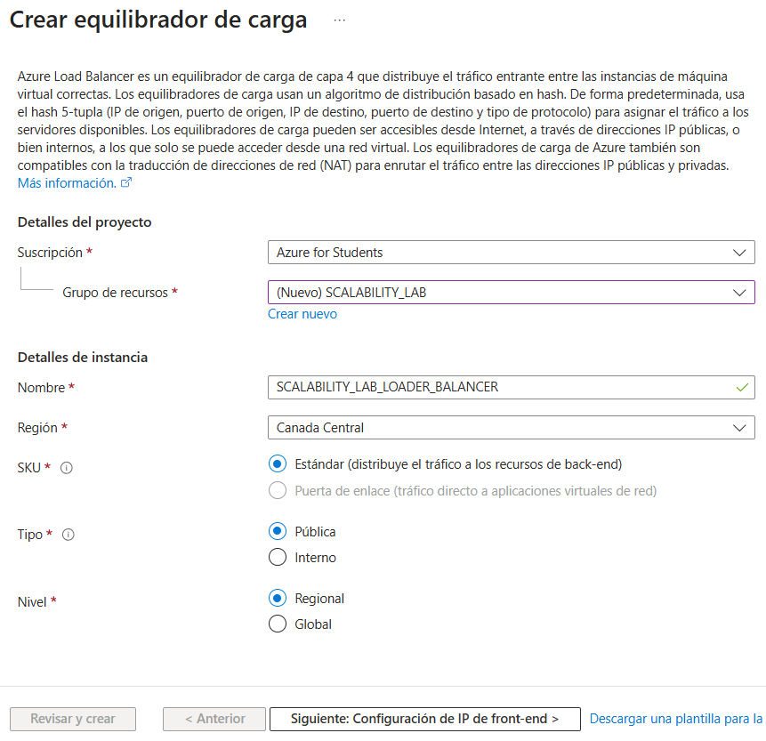

#### 2. creeamos un Backend Pool

#### 3. creamos un  Health Probe

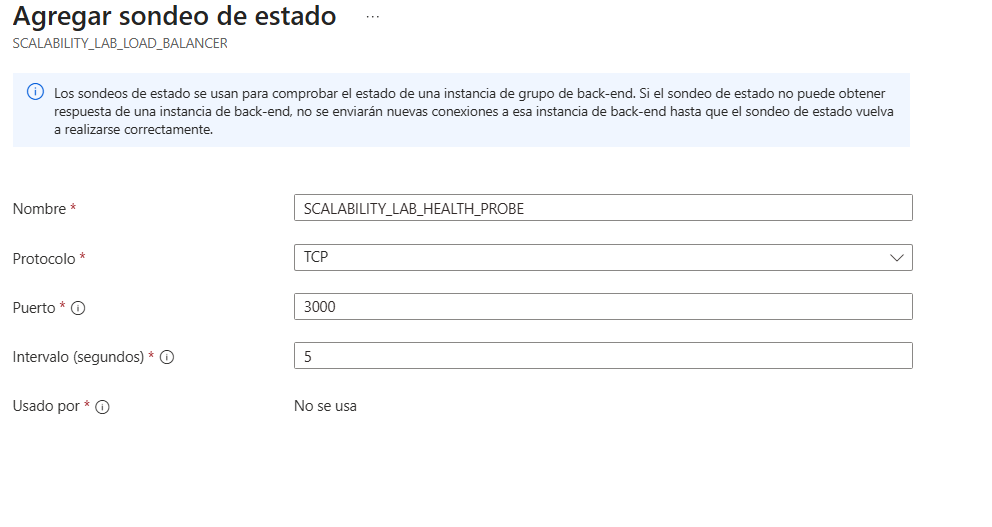

#### 4. Agregamos la regla

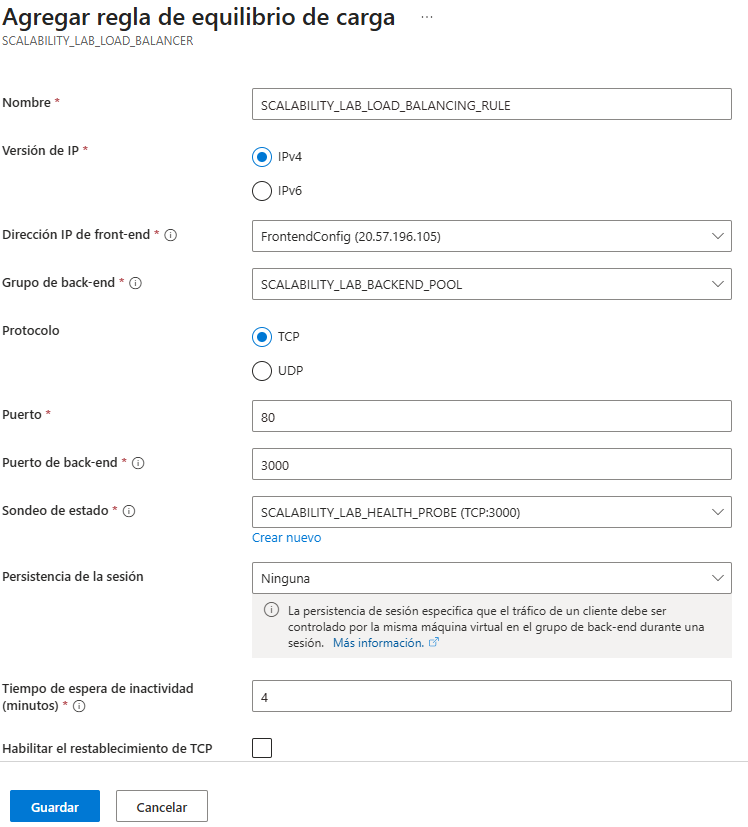

#### 5. creamos una Virtual Network dentro del grupo de recursos

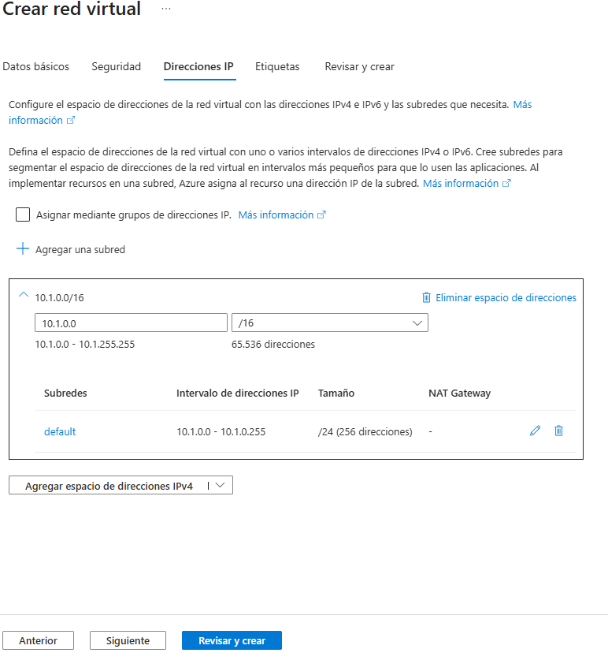

#### 6. Aqui creamos las respectivas VM 

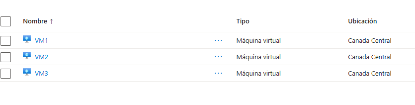

#### luego de clonar el repositorio verifcamos que funciona el endpoint y probamos el resultado de nuestra infraestructura, donde se puede apreciar que es mas eficiente 

### 7. preguntas

## 1. ¿Cuáles son los tipos de balanceadores de carga en Azure y en qué se diferencian?

Azure ofrece dos tipos principales de balanceadores de carga:

- **Public Load Balancer (Público):**  
  Distribuye el tráfico proveniente de Internet hacia las máquinas virtuales dentro de una red virtual. Se utiliza cuando los servicios deben ser accesibles públicamente y requiere una dirección IP pública.

- **Internal Load Balancer (Interno):**  
  Distribuye el tráfico dentro de la misma red virtual o entre redes emparejadas (peered networks). No tiene IP pública y se usa para comunicación interna entre servicios.

La diferencia principal radica en el alcance del tráfico: el balanceador público gestiona tráfico externo, mientras que el interno se limita a tráfico privado dentro de Azure.

---

## 2. ¿Qué es SKU, qué tipos hay y en qué se diferencian?

**SKU (Stock Keeping Unit)** define la versión o nivel del recurso que se está creando, determinando su rendimiento, características y costos.  
En Azure, los balanceadores de carga pueden tener los siguientes tipos de SKU:

- **Basic:**  
  Ofrece funcionalidades básicas, no soporta zonas de disponibilidad, tiene menor capacidad de escalamiento y está pensado para entornos de desarrollo o pruebas.

- **Standard:**  
  Ofrece mayor rendimiento, soporte para zonas de disponibilidad, escalabilidad automática, métricas avanzadas y mayor seguridad (el acceso es cerrado por defecto).

La principal diferencia entre ambos es que **Standard** está diseñado para producción y alta disponibilidad, mientras que **Basic** es más limitado y solo se recomienda para entornos de prueba.

---

## 3. ¿Por qué el balanceador de carga necesita una IP pública?

El balanceador de carga necesita una **IP pública** cuando debe recibir tráfico desde Internet y distribuirlo entre las instancias de backend.  
Sin una IP pública, solo podría enrutar tráfico interno dentro de una red virtual (en cuyo caso sería un balanceador interno).

---

## 4. ¿Cuál es el propósito del Backend Pool?

El **Backend Pool** agrupa los recursos que recibirán el tráfico balanceado, como máquinas virtuales o conjuntos de escalado.  
El balanceador de carga distribuye las solicitudes entrantes entre las instancias de este grupo para optimizar el rendimiento y la disponibilidad del servicio.

---

## 5. ¿Cuál es el propósito del Health Probe?

El **Health Probe** verifica periódicamente el estado de las instancias dentro del backend pool.  
Si una instancia no responde correctamente, el balanceador deja de enviarle tráfico hasta que se recupere.  
Esto garantiza que solo las instancias saludables reciban solicitudes.

---

## 6. ¿Cuál es el propósito de la Load Balancing Rule?

Las **Load Balancing Rules** definen cómo el tráfico entrante se distribuye entre las máquinas del backend.  
Especifican el puerto de entrada, el protocolo, el puerto de destino y la configuración de la sonda de estado (Health Probe).

### Tipos de sesión persistente:
- **None:** cada solicitud puede ir a cualquier instancia disponible.  
- **Client IP:** todas las solicitudes del mismo cliente van siempre a la misma instancia.  
- **Client IP and Protocol:** mantiene la sesión en función de la IP y el protocolo.

La persistencia de sesión es importante porque garantiza coherencia en servicios con estado, pero puede afectar la **escalabilidad** al concentrar demasiadas solicitudes en una sola instancia.

---

## 7. ¿Qué es una Virtual Network? ¿Qué es una Subnet? ¿Para qué sirven los address space y address range?

- **Virtual Network (VNet):**  
  Es una red privada dentro de Azure que permite conectar recursos de forma segura y aislada.  
- **Subnet:**  
  Es una división lógica dentro de la red virtual que agrupa recursos con propósitos o políticas similares.  
- **Address Space:**  
  Define el rango total de direcciones IP disponibles en la red (por ejemplo, 10.0.0.0/16).  
- **Address Range:**  
  Define los rangos específicos asignados a cada subred dentro del espacio de direcciones general.

Estas configuraciones permiten una organización lógica y controlada del tráfico dentro de la red.

---

## 8. ¿Qué son las Availability Zones y por qué seleccionamos 3 diferentes zonas?  
¿Qué significa que una IP sea zone-redundant?

Las **Availability Zones** son zonas físicas separadas dentro de una misma región de Azure. Cada zona tiene su propio centro de datos independiente con energía, red y refrigeración propias.

Seleccionar **3 zonas** distintas permite distribuir los recursos entre diferentes centros de datos, asegurando tolerancia a fallos y mayor disponibilidad.

Una **IP zone-redundant** está disponible en todas las zonas de una región, por lo que si una zona falla, la IP sigue operando sin interrupciones.

---

## 9. ¿Cuál es el propósito del Network Security Group (NSG)?

El **Network Security Group (NSG)** actúa como un firewall interno que controla el tráfico de red entrante y saliente de las máquinas virtuales y subredes.  
Permite definir reglas de seguridad basadas en dirección IP, protocolo y puerto, para restringir o permitir comunicaciones específicas.

---